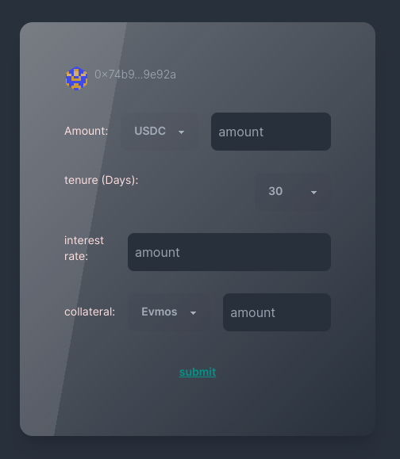
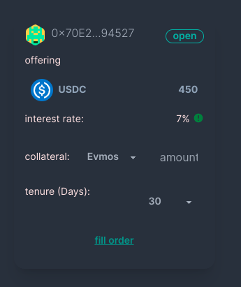
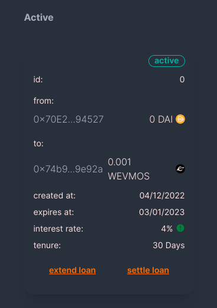
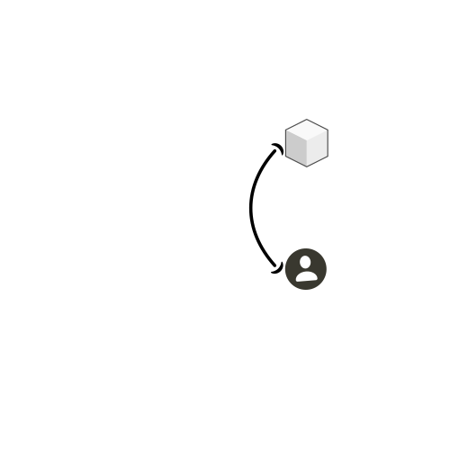
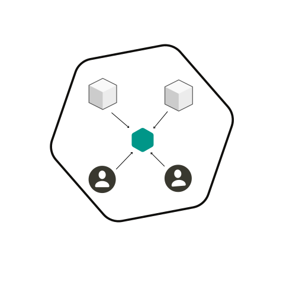
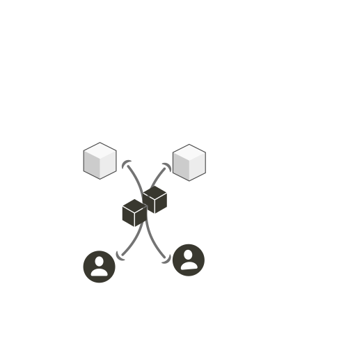
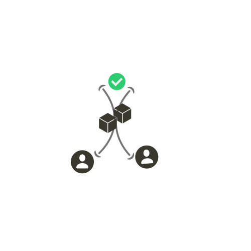
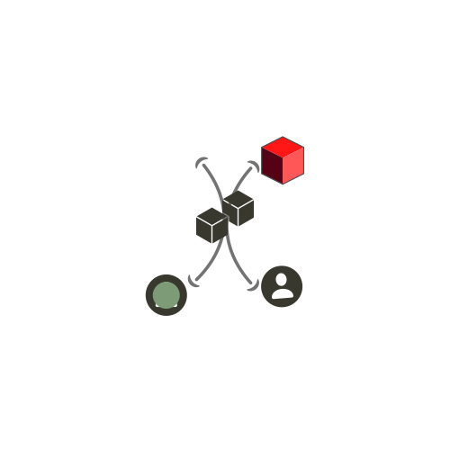

# AlcheMoney

alchemoney is a decentralised lending and borrowing system that is based on peer to peer nodes.
Each node represents a wallet to wallet direct loan service. Allowing users to directly fulfill the loan requests of an address or in turn a borrower can take loan directly from an address.
This model allows both parties to resolve their interest rate structure, collateral percentage and other possible requirements distinctively.

## Overview

The general flow allows users to create or take low risk loans by introducing parallel collateral yield farming.
This means, collateral deposits by the borrower will increase with time to help mitigate the effects of the price volatility of non stable crypto assets.

## How it works

* A user creates a partial node



* A user fulfills the other partial node



* a new node is created from both partial nodes
* exchange of requeststed stable assets for addresses collateral
* node marked as active/running
* timestamp snapshot created

* Want to close the position, the address has to deposit back the stables + interest to take back his collaterals+ yields



## Nodes

Each node represents a position,
There are three types of nodes

* BNodes : liquid nodes. These are partial nodes created when an address makes a loan request. With provided collaterals, acceptable interest range, and loans expected duration


* LNodes: stable nodes. These are partial nodes created when an address offers a stable coins to possible needers,



* Node: this represents a full node.
It is created when a lender merges with a borrower and exchanges values.



## Node transitions

* Partial to full: here two participants joins to form a node



* Full to settled: here the borrower exits a node by refunding the loan + interest to the lender



* Full to restricted: a node can only move from full to restricted if

    1. The lender forcefully exits a loan; if repayment is not made on time and the loan duration has expired
    2. The position is liquidated; due the price activity, the collateral can't keep the partial nodes together



### Interest Rate structure

The interest rates are fixed. The addresses have the free will to set their interest rates from 0 - 15% of they stable they are offering

Tenure: due to the low liquidation risks as a result of collateral yields and stable backed nodes. It is safe to stay that users can leave their positions open too long Which disincentives the lenders.
The tenures in days accepted are 30, 60, and 90 days respectively.
However, should the borrower not be able to meet up with expectations, their is a chance to extend the loan by extra 15%.
If loan tenure has expired, then lender has express right to forcefully take out his money+ interest by selling of the borrower's collateral

### Defaulting

The tenures provided are to be adhered to by node participants. In a situation where there's forceful exit. The corresponding node participants gets restricted for that particular node.
This is a transparent market. Meaning future participants can draw analysis based on how many restrictions you get and decide to offer loans or not.

### Liquidation

A node will be closed if the corresponding collateral+ collateral yields tied goes below 105% of initial stable giving out excluding interest accrued during the nodes lifespan

## Transparency

please visit [Alchemoney](https://alchemoney.vercel.app).
The UI provides all the opportunity to conduct visual analysis on a partial node holder before fulfilling the request by inspecting the user address lend/borrowing activity.

## Tokenomics and mathematics

There are 5 accepted stable assets USDC, BUSD, USDT, FRAX and DAI and there are an adjustable number of collateral assets accepted.
The collaterals accepted and corresponding onchain prices are fetched from dia price oracles.
The quotation of any accepted Is based on
`Collateral asset price in USD * expected stables / 4 + expected stables`.

## Parallel collateral yields

Once a new node is activated, the corresponding collateral is transferred to a yield/amm upon which the collateral will earn yields + earn Alchemoney tokens.
This helps keep the balance sheet healthy by ensuring the collateral value increases with time.
However this feature is yet to be implemented.

## Vaults

the vaults were adapted from

* [openzeppelin](https://github.com/OpenZeppelin/openzeppelin-contracts/blob/master/contracts/token/ERC20/extensions/ERC4626.sol
)
* [blog](https://blog.logrocket.com/write-erc-4626-token-contract-yield-bearing-vaults/
)
* [transmission](https://github.com/transmissions11/solmate/blob/main/src/mixins/ERC4626.sol
)

Alchemoney implemented a multi token vault that manages shareholders across 5 stable coins.
The vault is [EIP4626-like](https://eips.ethereum.org/EIPS/eip-4626), but does not implement all methods in erc4626 as well as allows several modifications it's contract methods to allow multi token management.

### Future implementations and features

The current model does not give node participants the ability to define who can fulfill their positions.
It also doesn't allow participants to manually authentic all received loan requests. This can be fixed.

With possible inclusion of smart-contract automation protocol on evmos, the liquidation logic will be transferred onchain.

Users have no power to initiate undercollateralised loans due to risk factors, but however if participants are given the opportunity to set collateral percentage for trusted addresses, there can be a system of direct crypto loan service between friends e.g from Vitalik to Nader provided nader is a trusted contact.

Crosschain interaction with osmosis and broader Cosmos defi ecosystems to unlock larger liquidity and and tools native to the cosmos app specific chains.

### Challenges I ran into

Working with price manipulation, percentages and oracle requests was a challenge. Trying to ensure that oracle responses tallied with price calculations given non uniform token decimals and and different unit(x) used when handling token calculations and balance sheet management.
Implementing a multi-token vault to handle shareholders management for 5 stable tokens

### not yet implemeted

1. diffusion swap for collateral swaps
2. testnet oracle with dia
3. yield bearing collateral
4. liquidation

### Set up

1. Contracts

```bash
git clone https://github.com/peteruche21/lendego.git
# set up your .env variable
# rename .env.example to .env and provide the required keys
cd contracts
# follow docs at https://book.getfoundry.sh to set up forge, cast and anvil
yarn install
forge build
# to deploy mock tokens
sh ./deployTokens.sh
# deploy with forge create
sh ./deploy.sh <usdc address> <usdt address> <busd address> <dai address> <frax address>
# deploy script
# local: optional to deploy to local anvil node
# local --fork: optional to deploy to evmos mainnet fork
sh ./runscripts.sh [local] [--fork] # currently not working though.
```

2. Front-end

```bash
# assuming you have already cloned this repo
cd client
yarn install

# development
yarn dev

# for prod
yarn build
yarn start
```
